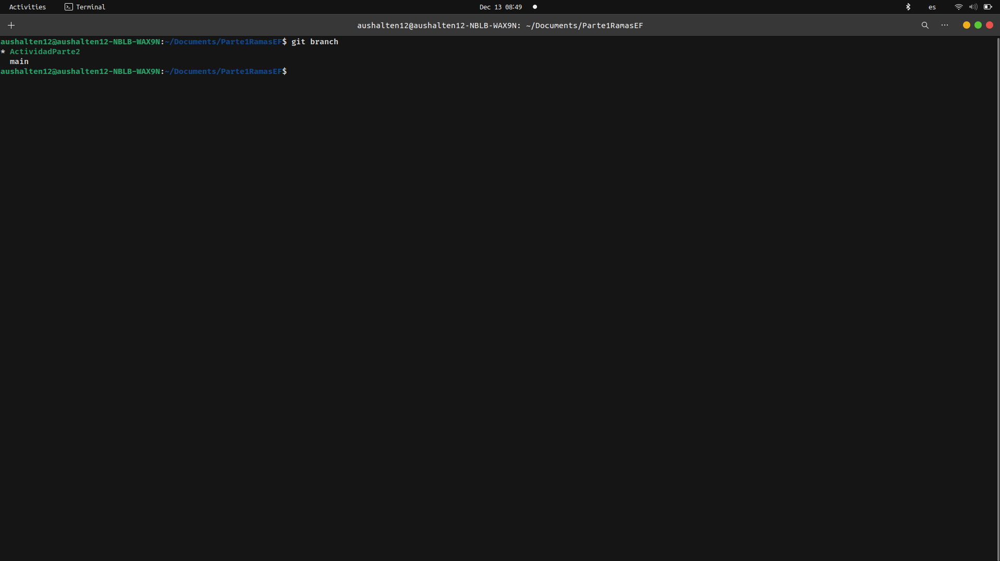

# Respuestas Exaneb Final

1. Produce un conflicto de fusión (merge) en algún repositorio de tus actividades realizadas. Establece los pasos y comandos que usas para resolver un conflicto de fusión en Git. Si intentas git push y falla con un mensaje como : Non-fast-forward (error): failed to push some refs esto significa que algún archivo contiene un conflicto de fusión entre la versión de tu repositorio y la versión del repositorio origen. Para este ejercicio debes presentar el conflicto dado, los pasos y comandos para resolver el problema y las solución.
   
   Vemos que tenemos dos ramas en ese repositorio que es de la actividad de Rails-Avanzado
   
   Tengo dos ramas que en una tengo un README con el contenido "Iniciando" y en la otra rama tengo el contenido de "Empezando".
   Al hacer git merge ActividadParte2 en la rama main aparece ese conflicto
   Para solucionar esto podriamos volver al anterior commit
   con `git reset --hard` Y podriamos hacer los cambios como eliminar esa linea en una rama luego al hacer merge ya no habria conflictos.
   
2. Digamos que nos dan el modelo de User de la siguiente manera:

```ruby
class User < ActiveRecord::Base
validates :username, :presence => true
validate :username_format
end
```

- Pregunta : **Qué pasa si tenemos @user sin nombre de usuario y llamamos a @user.valid? ¿Qué guardará @user.save**
  Al llamar a `@user.valid` retornara false. Al intentar guaradarlo con `@user.save` devolvera tambien false
- Pregunta : **Implementa username_format. Para los propósitos, un nombre de usuario comienza con una letra y tiene como máximo 10 caracteres de largo. Recuerda, las validaciones personalizadas agregan un mensaje a la colección de errores.**

```ruby
class User < ActiveRecord::Base
validates :username, :presence => true
validate :username_format
  def username_format
    errors.add(:username,'must be max 10 characters') if
    username.length() > 10
    errors.add(:username,'must be start with a letter') if
    /^[A-Za-z]/.match(username)
  end
end
```

 

3. Recuerda, los filtros nos ayudan a verificar si ciertas condiciones se cumplen antes de permitir que se ejecute una acción del controlador. Para el modelo de User, digamos que queremos verificar si @user era administrador de todos los métodos en AdminController. Completa el método before_filter:check_admin a continuación que verifica si el campo de administrador en @user es verdadero. De lo contrario, redirija a la página admin_login con un mensaje que indica acceso restringido.

4. AJAX (JavaScript y XML asíncronos) es un grupo de herramientas y técnicas para el desarrollo de aplicaciones web asíncronas. El objetivo de AJAX es que la comunicación entre una aplicación y el servidor de datos (es decir, solicitudes HTTP) no interfiera con la experiencia, la visualización y el comportamiento de la aplicación. A continuación, se te proporciona un formulario que simula el inicio de sesión. Comprueba si la combinación de nombre de usuario y contraseña funciona junto con la cuenta, si la hay. Para hacer eso, queremos que se realice una solicitud HTTP POST cuando se envíe este formulario. Escribe tu solución con jQuery y comenta dónde debe ubicarse la función de devolución de llamada (callback). Comprueba tus resultados.

En index.html.erb

```ruby
<form method="POST" id="foo">
<input type="text" class="user" />
<input type="password" class="pass" />
<input type="button" value="Log␣in" id="onSubmit" />
</form>
```

En application.js

```javascript
//= require jquery
//= require rails-ujs
//= require activestorage
//= require turbolinks
//= require_tree .

$("#onSubmit").click(function () {
  let user_data = [];
  let name = $(".user").val();
  let password = $(".pass").val();
  user_data.push(name);
  user_data.push(password);
  $.ajax({
    url: "users/login",
    type: "POST",
    data: {
      user_datos: user_data,
    },
    success: () => {
      alert("Se ha logeado correctamente");
    },
  });
});
```

Verifica si el usuario se ha logeado correctamente con una solicitud ajax


5. ¿Cuándo deberías utilizar la metaprogramación basada en eval en lugar de la metaprogramación basada en bloques?.
   Se utiliza eval en lugar de una metaprogramación basada en bloques cuando se desea generar codigo adicional.

```javascript
const blog = {
  nombre: "freeCodeCamp",
};
console.log("Antes de eval:", blog);

const clave = "autor";
const valor = "Tapas";
testEval = () => eval(`blog.${clave} = '${valor}'`);

// Llama a la funcion
testEval();

console.log("Despues de la magia de eval:", blog);
```


Vemos que blog cambia despues de usar eval se genero un campo adicional en blog

## Parte 2

Configuramos todo correctamente


- Paso 1
  
  Agregamos un boton que nos lleve a buscar la pelicula
  
  Ahora podemos ver el formulario para buscar la pelicula
  Creamos las pruebas en spec/controller, ejecutamos las pruebas con `bundle exec rspec`
  
  Eso seria todo el primer paso  
- Paso 2
  
-
